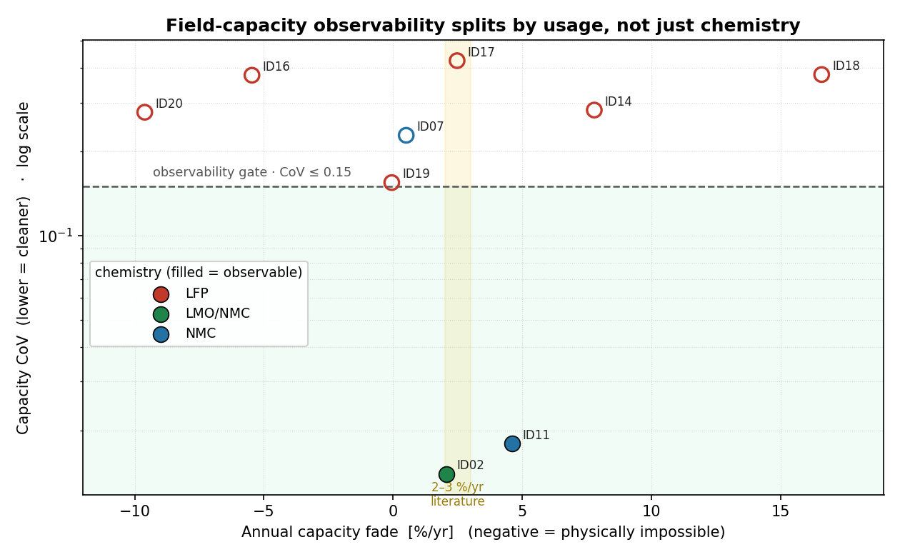

# Residential BESS fleet — cross-chemistry health & diagnostics

A battery-diagnostics platform for residential energy storage, built on the
[Figgener et al. 2024](https://www.nature.com/articles/s41560-024-01620-9)
open dataset — up to **10 systems across three cathode chemistries** (LFP,
NMC, LMO/NMC), instrumented at one-minute cadence over up to eight years.

It began as a six-rack LFP fleet view and grew a chemistry-aware diagnostic
layer whose flagship is **degradation-mode estimation**: reconstruct
quasi-OCV curves from ordinary field operation to read out *which* ageing
mechanism is at work — and, crucially, *measure whether the field data can
support that read at all*.

The repo is organised as a proper Python package: a medallion-lakehouse
pipeline over DuckDB feeds a chemistry-aware analytics layer; a Streamlit app
reads only through a single-source-of-truth module.

---

## Headline result — capacity observability splits by usage, not just chemistry



The degradation-mode pipeline reconstructs quasi-OCV sweeps from low-dynamic
field operation, runs incremental-capacity / differential-voltage analysis
(ICA/DVA), and attributes capacity loss to **loss-of-lithium-inventory (LLI)**
vs **loss-of-active-material (LAM)**. A mode is published *only when the
capacity trend clears a confidence gate* — coefficient of variation ≤ 0.15 and
fade R² ≥ 0.30.

Across 10 systems every LFP rack **fails** the gate: the flat ~60 mV plateau
defeats field capacity estimation from partial cycles, and several show
physically-impossible negative fade. The systems that **pass** are NMC-family
and land on literature-consistent fade (2.1 / 4.6 %/yr, R²≈0.88) — yet one NMC
system fails too (noisier, gap-filled data), so observability is *measured per
system, not assumed from the datasheet chemistry*. The framework's value is
knowing the difference rather than emitting a confident-looking wrong number.
Method mirrors Figgener et al. (*Nat Energy* 2024) and arXiv 2411.08025.

---

## What's in the box

```
src/bess_fleet/
├── db.py                       # DuckDB view registrar
├── recommendations.py          # operator-facing rule engine
└── pipeline/                   # 8 idempotent build modules
    ├── raw_to_1min_parquet.py    bronze: raw zips → 1-min parquet
    ├── clean_temperatures.py     silver: sentinel scrub
    ├── load_identity.py          silver: XLSX → identity.parquet (+ chemistry)
    ├── derive_features.py        silver: ΔT, c_rate, energy_*
    ├── derive_soc.py             silver: chemistry-aware OCV-corrected SoC
    ├── build_daily_kpis.py       gold:   daily aggregates + 4-gate RTE
    ├── detect_threshold_events.py gold:  rule-based events
    └── degradation_modes.py      gold:   ICA/DVA degradation modes (LLI/LAM)

app/
├── Fleet_Overview.py           # severity-first systems table
├── pages/1_System.py           # per-rack telemetry deep-dive
├── pages/2_Degradation.py      # cross-chemistry degradation modes
└── _components/
    ├── data_access.py           cached DuckDB queries (`get_*`)
    ├── analytics.py             cached compute functions (`compute_*`)
    ├── data.py                  re-export facade for the above
    ├── charts.py                Plotly chart builders
    ├── kpis.py                  layout primitives (HTML)
    ├── alerts.py                alert-detail UI helpers
    └── theme.py                 Operator-Light CSS

tests/                          # test suite
```

---

## Headline KPIs

All three are computed in [`build_daily_kpis.py`](src/bess_fleet/pipeline/build_daily_kpis.py)
or in the analytics layer:

| KPI | Definition | Notes |
|---|---|---|
| **Daily RTE** | `Σ energy_out / Σ energy_in` per day | Four-condition gate — see below |
| **Daily cycling (EFC/day)** | `throughput / (2 × nameplate)` | Capacity-relative throughout |
| **Availability** | `n_samples × (1 − interp_frac) / 1440`, capped 100 % | DST-cap + interpolation-discount |

### The RTE confidence gate

`RTE` returns `NULL` unless **all four** are true. Capacity-relative
thresholds generalise the rule across fleet sizes (5 kWh → 1 MWh)
without re-tuning:

```sql
energy_in  >= 0.10 × capacity_kwh    -- meaningful charging
energy_out >= 0.05 × capacity_kwh    -- meaningful discharging
energy_out / energy_in <= 1.05       -- physically plausible
ABS(soc_end - soc_start) <= 10       -- cycle closes
```

After the gate, 38–83 % of daily rows return NULL across the fleet —
by design. The survivors give a fleet mean RTE of 81–88 %, the LFP
residential ballpark.

---

## Running it

```bash
# 1. install
pip install -e .[dev]

# 2. fetch the Figgener dataset (citation in bootstrap_data.py),
#    place zips at data/raw/figgener_meta/Data_ID_*.zip

# 3. rebuild bronze → silver → gold (~3 min)
python bootstrap_data.py

# 4. tests
pytest tests/

# 5. dashboard
streamlit run app/Fleet_Overview.py
```

The `data/` folder is git-ignored (the raw zips total ~12 GB) — see
[`bootstrap_data.py`](bootstrap_data.py) for the data source and the
pipeline order.

---

## Architectural decisions

- **Parquet on disk = source of truth.** DuckDB is the query layer
  over parquet globs; the catalogue file (`data/bess.duckdb`) is
  expendable and rebuilds in ~200 ms from any state.
- **Single source of truth in `data.py`.** Every numeric quantity on
  the UI is computed in one module and consumed by every page. Charts
  do visuals; pages compose. No SQL in page code.
- **Idempotent pipeline.** Each of the seven build modules can be re-
  run alone to refresh its output without recomputing the upstream
  layer.
- **Capacity-relative thresholds.** Anywhere a threshold could be
  expressed as a fraction of nameplate (RTE confidence gates, EFC,
  C-rate), it is. The same code is correct on a 5 kWh residential
  rack and a 1 MWh utility system.

---

## Data

[Figgener, J. et al. (2024)](https://doi.org/10.1038/s41560-024-01620-9).
Multi-year field measurements of home storage systems and their use
in capacity estimation. *Nature Energy*, open dataset.

Six LFP residential systems, ~12 M rows of 1-minute telemetry across
2015–2022, single manufacturer.

---

## Stack

| Layer | Tool |
|---|---|
| Language | Python 3.11+ |
| Storage | Apache Parquet (PyArrow 16) |
| Query | DuckDB 1.5 |
| Data | pandas 2.2, numpy 1.26 |
| UI | Streamlit 1.35, Plotly 5.20 |
| Tests | pytest 8 |
